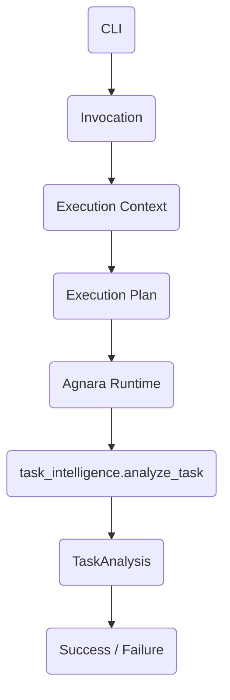

# Agnara Task Intelligence

**Agnara Task Intelligence — Historical Reference Application #001**

A small, intentionally simple application that preserves and demonstrates the capabilities available in the early public releases of the Agnara framework.

## Historical Significance
This project is the first historical reference application built externally with Agnara from its public PyPI distribution. It serves as a functional application, an educational project, an agent-first repository, and a historical baseline for observing the evolution of Agnara.

It uses:
- **Agnara version**: `0.1.0a2`
- **Python baseline**: `3.14+`

## What This Demonstrates
This reference application demonstrates the following core Agnara capabilities:
- Capability registration and metadata (`scopes`, `risk`, `idempotent`)
- Schema inference from Python type hints
- Execution plan compilation
- Canonical invocation and execution context
- Canonical `Success` and `Failure` outcomes
- Native input validation (e.g., rejecting an `int` when a `str` is expected)
- Completely transport-agnostic execution

## Architecture
The application separates the human interface (CLI) from the business logic via the Agnara Runtime:



## Current Limitations
This project explicitly reflects the scope of Agnara `0.1.0a2`. It **does not** demonstrate HTTP, MCP, A2A, or Event transports, as those features are out of scope for this specific historical baseline.

## Requirements
- Python >= 3.14 (tested with CPython 3.14.4)
- Pip

## Installation

On Windows, ensuring you use the correct Python version (since multiple versions might exist):

```bash
py -3.14 --version
py -3.14 -m venv .venv
.venv\Scripts\activate
python -m pip install --upgrade pip
pip install -r requirements.txt
```

On Linux/macOS:

```bash
python3.14 -m venv .venv
source .venv/bin/activate
python -m pip install --upgrade pip
pip install -r requirements.txt
```

## Usage

```bash
python app.py
```

### Examples

**Low Risk Task:**
```text
Describe a software task: Create a contact page
```
Output will indicate `complexity: low`, `risk: low`, and `requires_review: False`.

**High Risk Task:**
```text
Describe a software task: Implement OAuth authentication, database migration and payment security
```
Output will indicate `complexity: high`, `risk: high`, and `requires_review: True`.

### Validation Example
If you programmatically pass an invalid payload like `{"task": 12345}` instead of a string, Agnara natively handles it and returns a canonical failure:
```text
Failure code: invalid_input
Message: expected str, got int
```

## Agnara Execution Model
1. **Python Annotation**: Type hints define the expected data.
2. **Agnara Schema**: Agnara infers the schema from the annotations.
3. **ExecutionPlan**: The app compiles the capabilities into a plan.
4. **Invocation**: A payload is sent to the capability.
5. **Validation**: Agnara validates the payload against the schema.
6. **Capability**: The logic is executed.
7. **Success / Failure**: A canonical result is returned.

## Roadmap
- `v0` — single capability (Current)
- `v1` — multiple capabilities
- `v2` — dependency injection
- `v3` — additional Agnara adapters when publicly available

## Documentation
- [Architecture](docs/architecture.md)
- [Capabilities](docs/capabilities.md)
- [Historical Baseline](docs/history.md)

## Agent Guidelines
See [AGENTS.md](AGENTS.md) for rules on maintaining this repository with AI coding agents.

## Contributing
See [CONTRIBUTING.md](CONTRIBUTING.md).

## Security
See [SECURITY.md](SECURITY.md).

## License
Licensed under the [Apache License 2.0](LICENSE).

## Related Projects
- [Agnara Framework](https://github.com/Blandskron/agnara)
- [Agnara on PyPI](https://pypi.org/project/agnara/)