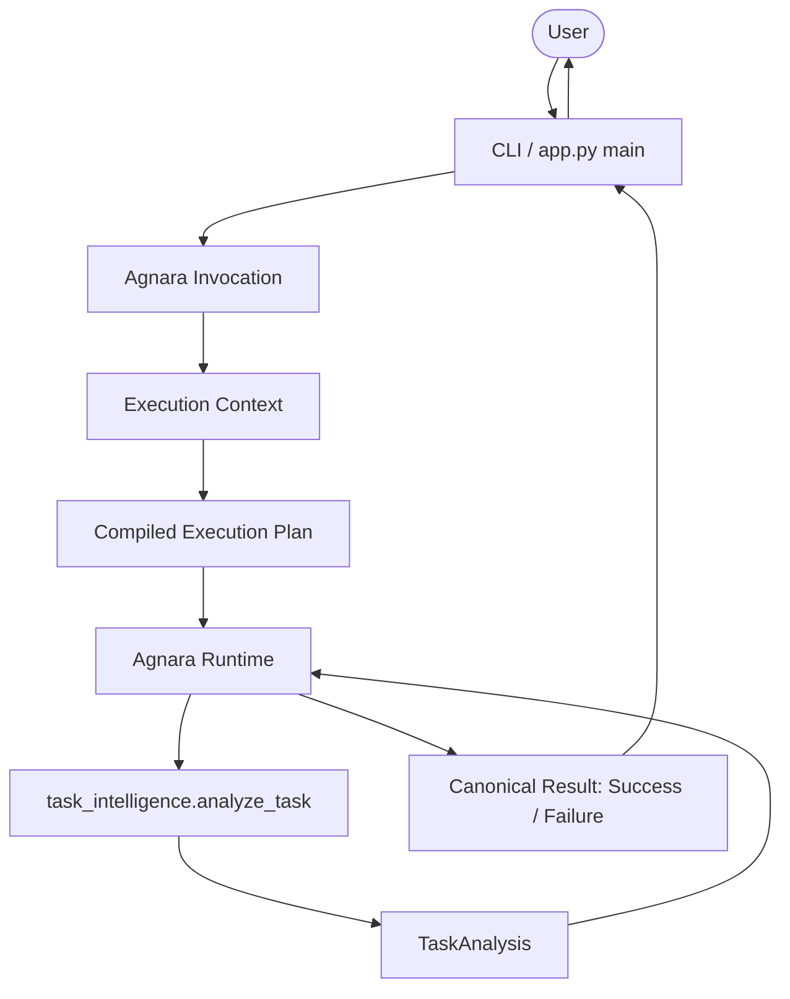

# Architecture

The architecture of this application demonstrates the decoupled execution model of Agnara.

## Concept: CLI != Agnara

The current CLI is simply the human entry point. It is not the core of the application. The business logic does not depend on the CLI, and it is executed through Agnara's independent runtime.

### Data Flow

## Why This Matters

This architecture ensures that the business logic (the capability) does not conceptually depend on the transport layer. In this reference application, we use a CLI to trigger the execution, but the capability itself is completely agnostic to whether it was invoked via CLI, HTTP, MCP, or another protocol.

Agnara handles the inference of schemas, input validation, and the structured return of `Success` or `Failure`.
